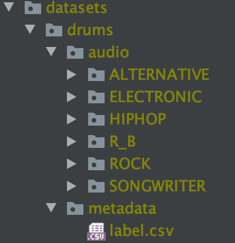

# Content-based audio classification

# How to run experiment
## 1. Install libraries (python>=3.8 is required)
`pip install -r requirements.txt`

## 2. Place dataset
`datasets/audio/` for audio files and
`metadata/label.csv` for labels

## 3. Train model
For training model on main classes  
`python -m src.experiment.frequency_domain_main_class`  

For training model on sub classes  
`python -m src.experiment.frequency_domain_sub_class`

# How to contribute
## Branch rule
Each pull request should follow the branch naming conventions as follows.

`/feature/{feature_name} (e.g. feature/add_lstm)`  
Branch contains new features, additions and optimizations.

`/hotfix/{fix_name} (e.g. hotfix/fix_data_loader)`  
Branch contains hotfix for existing features.

# Appendix
## Existing experiments
Here is the list of the experiments.

| Script                                     | Feature           | Model | Config               | Test Accuracy | Run Date |
| -------------------------------------------| ----------------  | ----- | -------------------- | ------------- | -------- |
| `frequency_domain_main_class.py`           | Mel-spectrogram   | CNN   | frequency_domain.ini |73%            |2022-09-01|
| `frequency_domain_sub_class.py`            | Mel-spectrogram   | CNN   | frequency_domain.ini |67%            |2022-09-01|
